# 基盤地図情報（数値標高モデル）

* __基盤地図情報（数値標高モデル）__ とは
	* __基盤地図情報（数値標高モデル）__ は、標高のメッシュデータの情報です。
	* 地域によって整備方法や情報の精度が異なっており、1mメッシュ（標高）、5mメッシュ（標高）、10mメッシュ（標高）の3種類があります。
	* ファイル形式は __JIS X7136（地理マーク付け言語 Geography Markup Language (GML)）__ に基づいて、XMLの形式で符号化したデータファイルです。
* GML 形式の詳細な仕様について
	* 国土地理院のサイトにドキュメントがありますので、詳しくはそちらを参照してください。
		* [基盤地図情報（数値標高モデル）について](https://fgd.gsi.go.jp/download/ref_dem.html)
		* [基盤地図情報ダウンロードデータファイル仕様書](https://fgd.gsi.go.jp/download/documents.html)
		* [キッズページ > DEM（数値標高モデル）](https://www.gsi.go.jp/KIDS/KIDS16.html)
* 利用に関して
	* 以下のリンクを参照してください。
		* [地理院ホーム > 申請 > 国土地理院の測量成果の利用手続 > 国土地理院の測量成果の利用手続](https://www.gsi.go.jp/LAW/2930-index.html)
		* 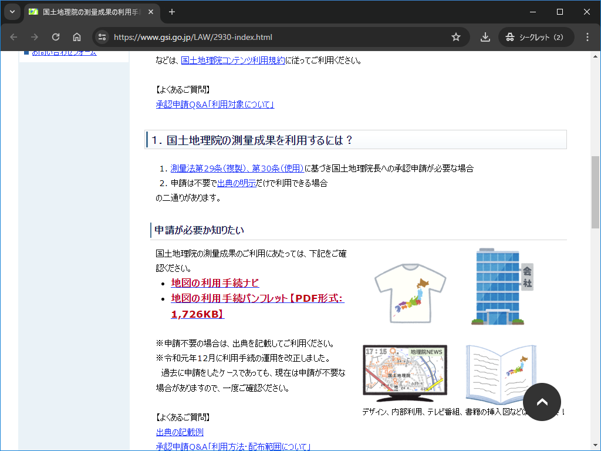

> [!NOTE]
> 詳細は公式ドキュメントに譲りますが、最低限の用語だけ説明します。
> * Mesh 区分について
> 	* Mesh 区分 は（標高モデルで使用するものは） 3 段階あります。
> 		| 区分	| 範囲							| おおよその広さ	| 番号表記	|
> 		|----	|----							|----				|----		|
> 		| Mesh1	| 緯度 40分 経度 1度 毎の範囲	| 80km 四方			| 4 桁		|
> 		| Mesh2	| Mesh1 を縦横 8 等分した範囲	| 10km 四方			| 4+2 桁	|
> 		| Mesh3	| Mesh2 を縦横 10 等分した範囲	|  1km 四方			| 4+2+2 桁	|
> 	* [総務省統計局 > 地域メッシュ統計について](https://www.stat.go.jp/data/mesh/m_tuite.html) にある __地域メッシュの区分図（PDF：270KB）__ がわかりやすいです。
> * __?m メッシュ__ の種類（ __DEM種別__ ）について
> 	* 1m,5m,10m のメッシュが存在しそれぞれの距離毎にサンプリングされた標高情報を持ちます。
> 		| 種別	| 提供エリア		| 種類										|
> 		|----	|----				|----										|
> 		| 1m	| 三陸海岸周辺のみ	| __標高(Dem1A)__							|
> 		| 5m	| ほぼ全国を網羅	| __標高(Dem5A)__ / __数値地形(Dem5B)__		|
> 		| 10m	| 高山周辺			| __火山標高(Dem10A)__ / __標高(Dem10B)__ 	|
> 	* 1m メッシュの提供エリアについて
> 		* 2024/07/31 に提供エリアが追加されました。詳しくは [こちら](https://maps.gsi.go.jp/#8/35.292710/136.785278/&base=pale&ls=pale%7Cfgd_dem1a_update_2024_07&disp=11&lcd=fgd_dem1a_update_2024_07&vs=c1g1j0h0k0l0u0t0z0r0s0m0f0&d=m) を参照してください。
> 	* 1m,5m,10m の 読み込みには対応していますが、今後バリエーションが増えた場合は対応が必要です。
> 	* [基盤地図情報 ダウンロードサービス](https://fgd.gsi.go.jp/download/documents.html) にある __基盤地図情報ダウンロードデータファイル仕様書__ が詳しいです。
> 		* ~~以下のようなアナウンスがあり、現在上記ページは見ることができません。~~
> 			> ~~2024年6月17日（月）16時頃からメンテナンスに伴い、基盤地図情報のダウンロードサービスが利用できなくなっております。~~
> 		* その後、以下のようなアナウンスがあり、ページを見ることができるようになりました。
> 			> 基盤地図情報のダウンロードサービスについて、7月16日（火）15時30分よりサービスを再開いたしました。  
> 			> 2024年6月17日（月）からのサーバメンテナンスに伴うサービス停止期間おいて、ご利用頂いている皆さまにはご不便、ご迷惑をおかけ致しましたことお詫び申し上げます。
> * 基盤地図情報（数値標高モデル）の高さの精度
> 	| 種別				| 測量形式					| 精度		| 備考										|
> 	|----				|----						|----		|----										|
> 	| DEM1A DEM5A	| 航空レーザ測量			| 0.3m 以内	| メッシュ内に計測点がない場合は 2.0m 以内	|
> 	| DEM5B				| 写真測量					| 0.7m 以内	|											|
> 	| DEM10A			| 火山基本図の等高線		| 2.5m 以内	|											|
> 	| DEM10B			| 1/25,000地形図の等高線	| 5.0m 以内	|											|
>	* なお、 __基盤地図情報（数値標高モデル）__ の標高値の記載は 0.01m 単位となっていますが、 0.1m 単位で求めたものが有効値であり、小数点以下 2 位については参考値として格納しています。

## 入手方法

1. [地理院ホーム 地図・空中写真・地理調査 基盤地図情報サイト](https://www.gsi.go.jp/kiban/index.html) にアクセスし、 __基盤地図情報のダウンロード__ を選択します。
	* 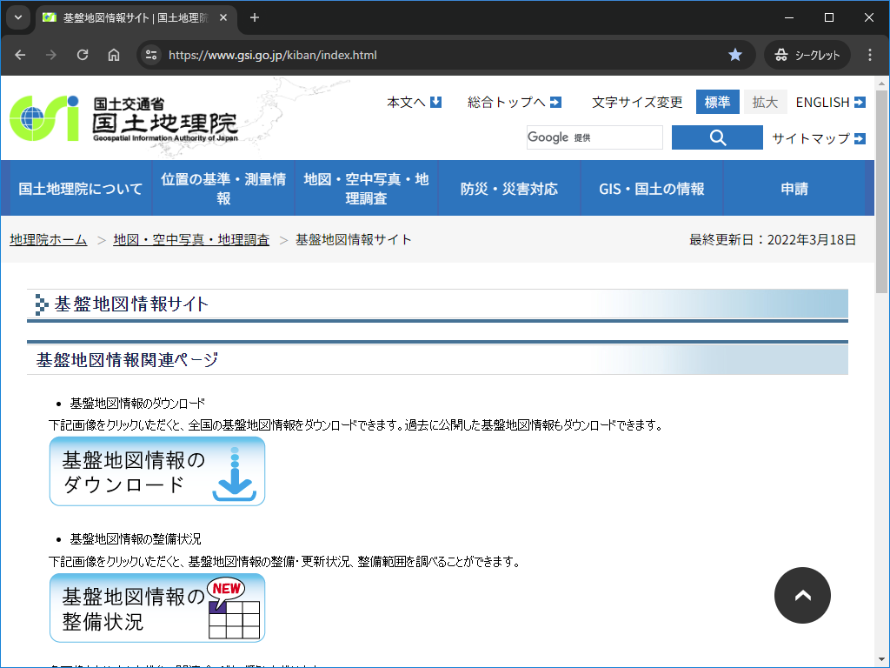
1. __基盤地図情報 数値標高モデル__ の __ファイル選択へ__ を選択します。
	* 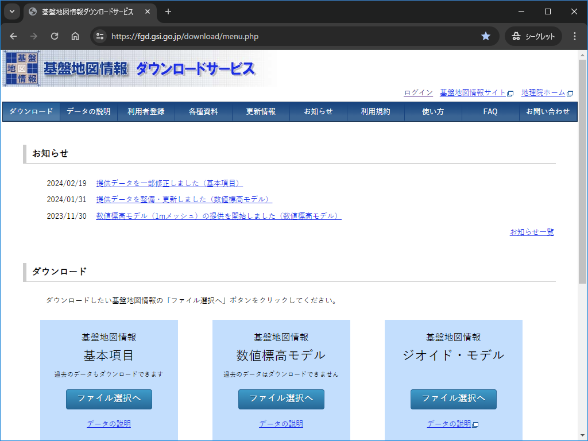
1. 地図から任意の場所のデータが選択できます。
	* 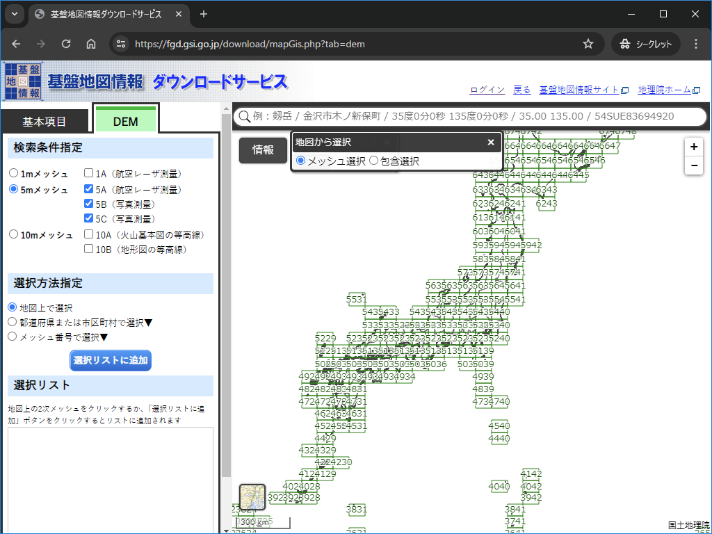
1. 例として、礼文島のデータを選択します。まずは __5m メッシュ__ が選択された状態で、礼文島を含むエリアを選択します。
	* 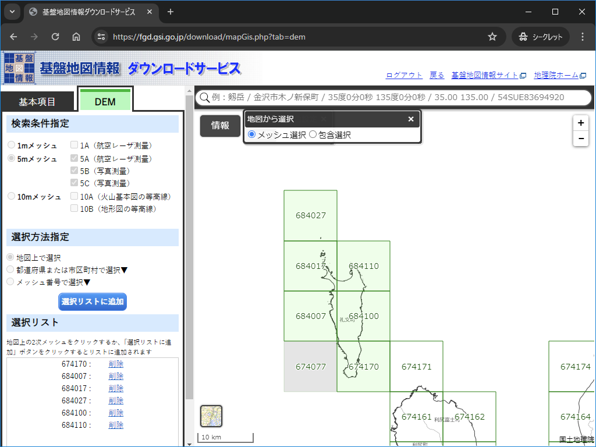
1. 選択後、左側のフレームの一番下の __ダウンロードファイル確認へ__ を選択します。
	* 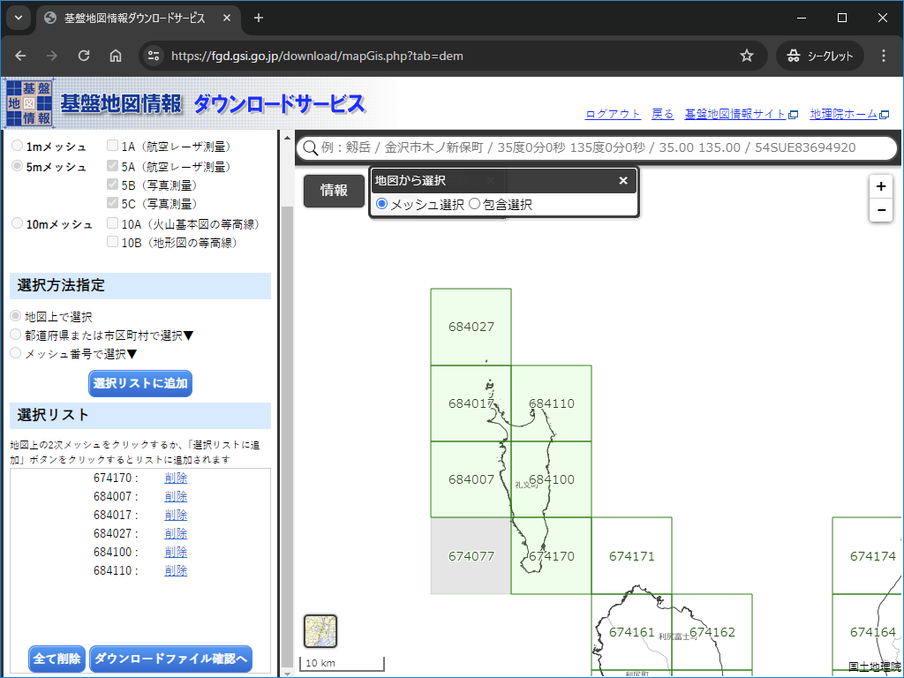
1. 今回はさらに __10m メッシュ__ もダウンロードするため、一旦 __戻る__ を選択します。
	* 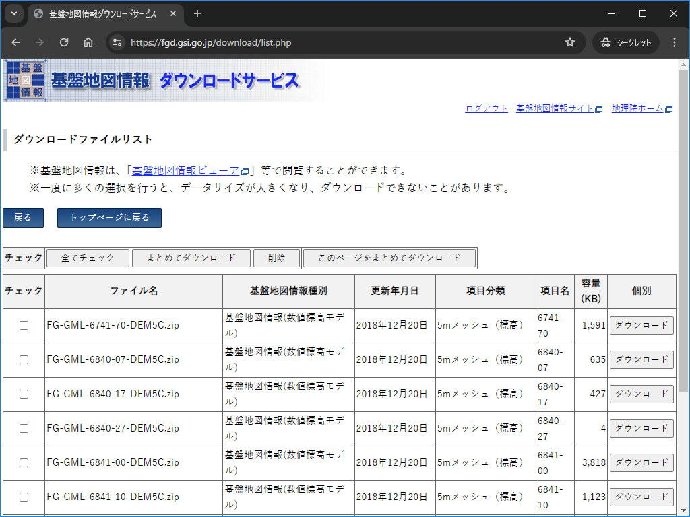
1. __10m メッシュ__ が選択された状態で、礼文島を含むエリアを選択し、左側のフレームの一番下の __ダウンロードファイル確認へ__ を選択します。
	* 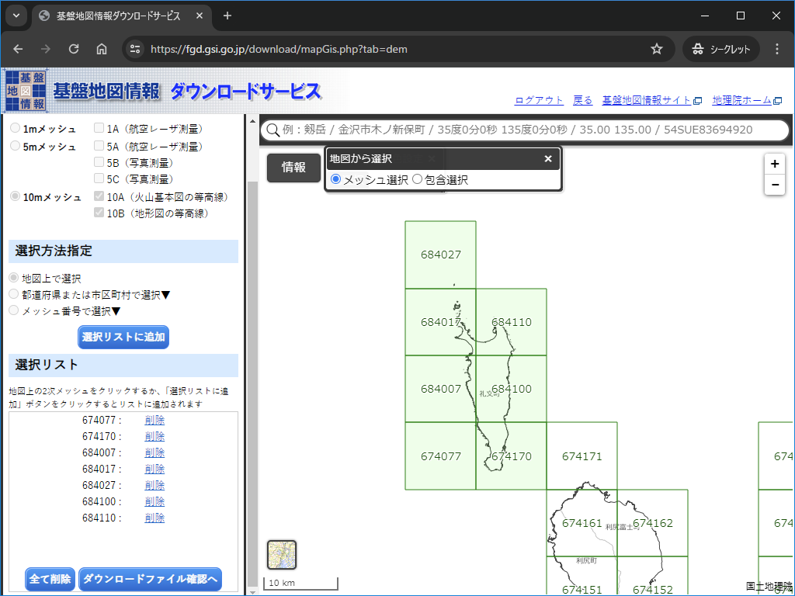
1. __すべてをチェック__ を選択し全データにチェックを入れ、 __まとめてダウンロード__ を選択します。
	* 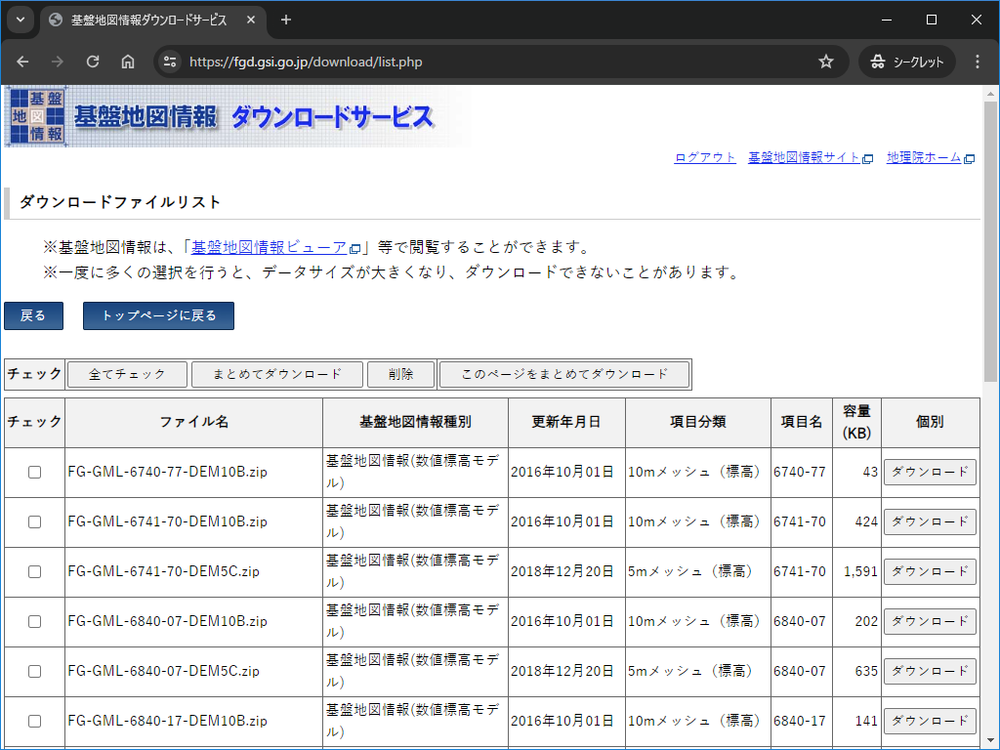
1. アカウント情報を入力し __ログイン__ を選択します。アカウントがなければ作る必要があります。
	* 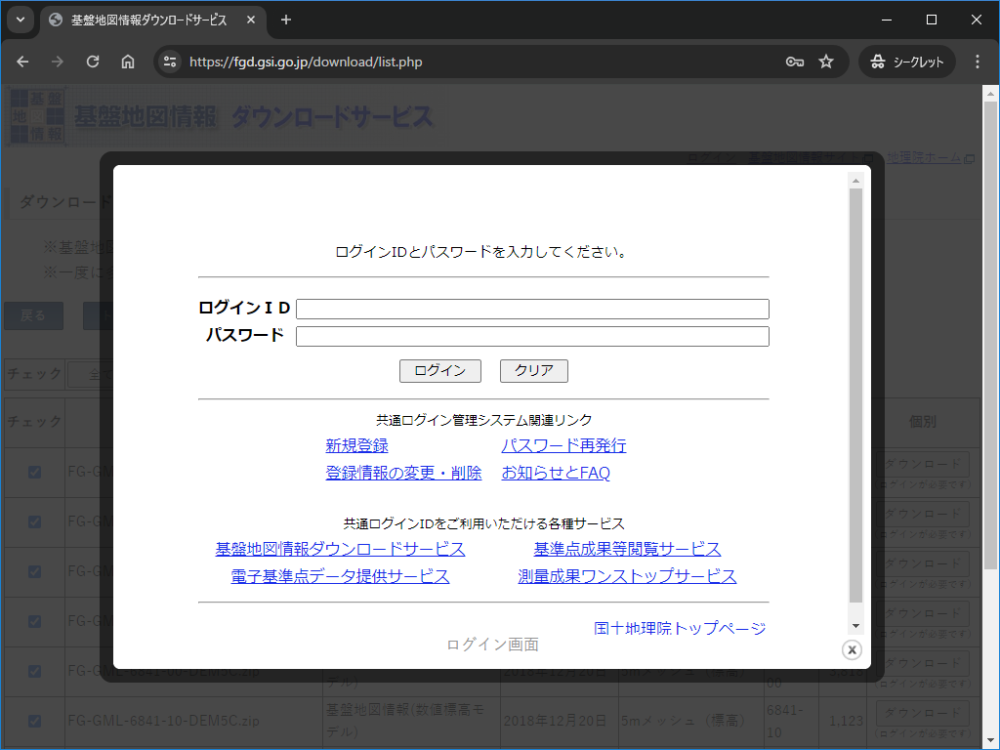
1. アンケートを入力し、 __次へ（アンケートの送信も自動で行います）__ を選択します。
	* 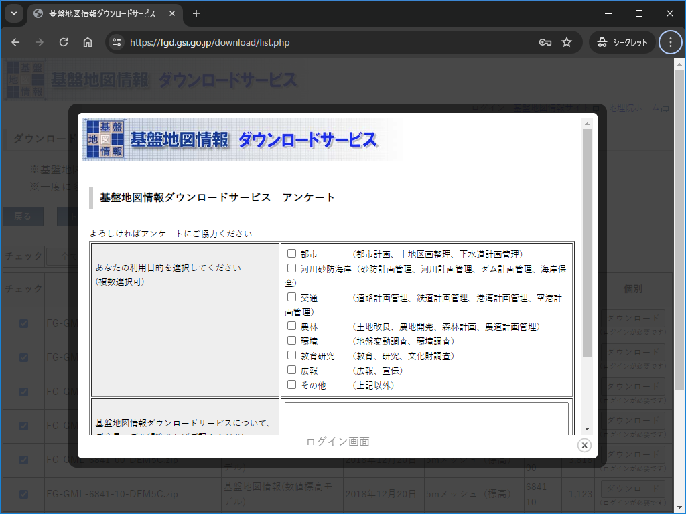
1. 以上で礼文島周辺の __5m メッシュ__ と __10m メッシュ__ を入手できました。データは zip になっているので展開します。
1. __PackDLMap.zip__ がダウンロードされますので、これを展開します。
	* 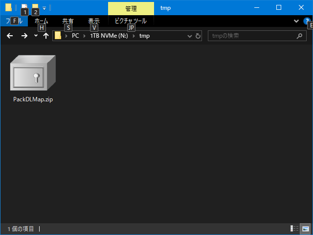
1. 展開後の様子
	* 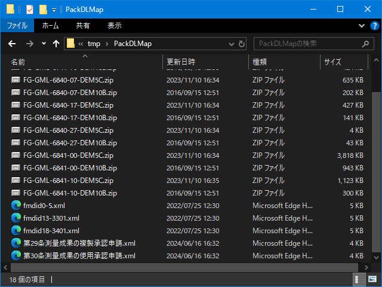
1. 中身は以下のようなものが入っています。
	| ファイル名                       | 概要                                                          |
	|----                              |----                                                           |
	| FG-GML-????-??-DEM*.zip          | GML ファイルが格納された zip ファイル。これをさらに展開する。 |
	| fmdid*.xml                       | データに関する説明が記述されている。                          |
	| 第29条測量成果の複製承認申請.xml | 申請関連のファイル。                                          |
	| 第30条測量成果の使用承認申請.xml | 申請関連のファイル。                                          |
1. __FG-GML-????-??-DEM*.zip__ を展開します。
	* 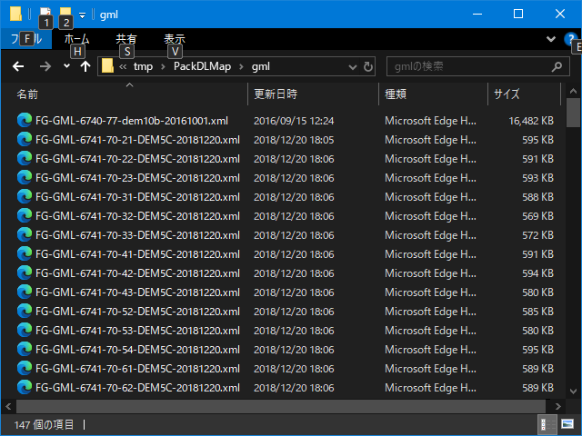
1. 以上で __基盤地図情報（数値標高モデル）__ の GML 形式のファイルを利用する準備ができました。

> [!NOTE]
> * ビューアについて
> 	* __基盤地図情報（数値標高モデル）__ は [基盤地図情報ビューア](https://fgd.gsi.go.jp/download/documents.html) (FGDV.exe)で中身を確認することができます。
>		* 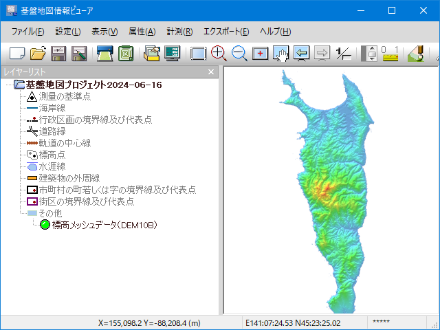
> 	* 以下のファイルを読み込ませることができます。
> 		* PackDLMap.zip
> 		* FG-GML-*.zip
> 		* FG-GML-*.xml
> 	* つまり、 FGDV.exe で利用するなら、 zip を展開しなくても読み込むことができます。
> 		* ※ただし、 __PackDLMap.zip__ は計測方法が異なるデータが混ざっている場合はそのままでは読み込めません。
> 			* 今回のように、__5m メッシュ__ と __10m メッシュ__ が混ざっている場合等。

以上。

----
