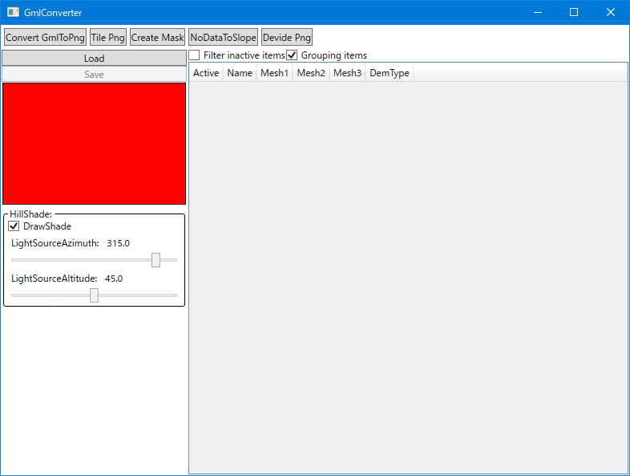
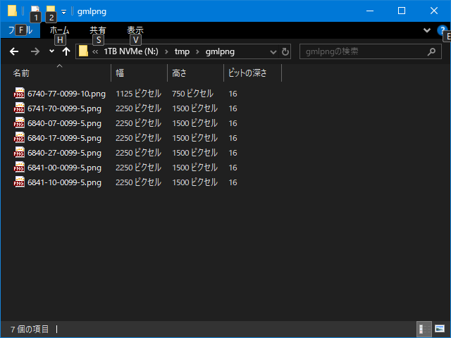
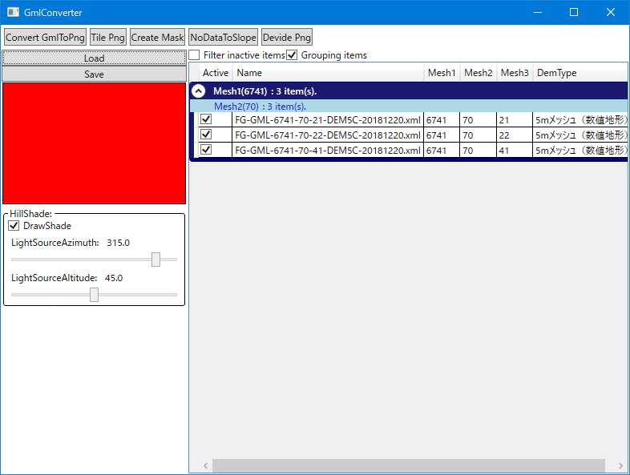
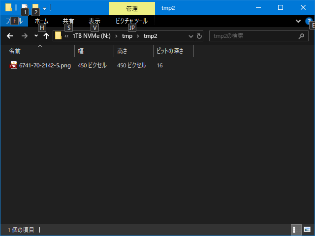
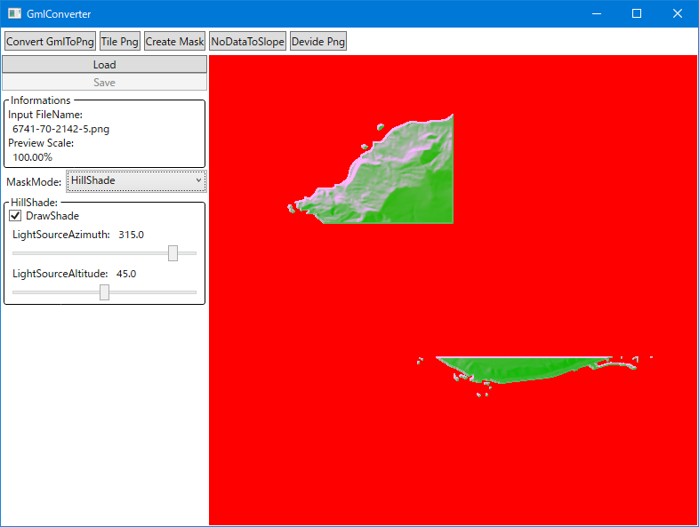
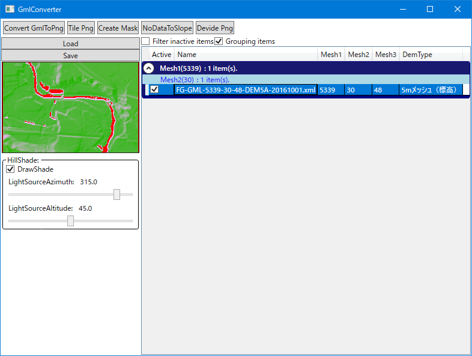
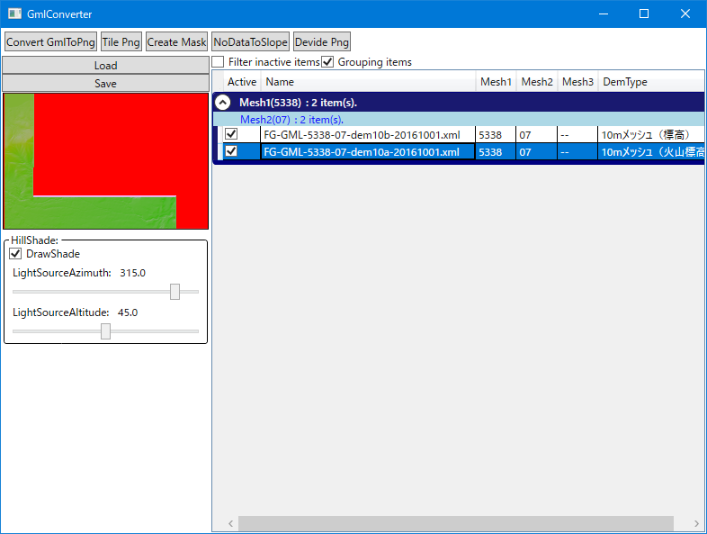
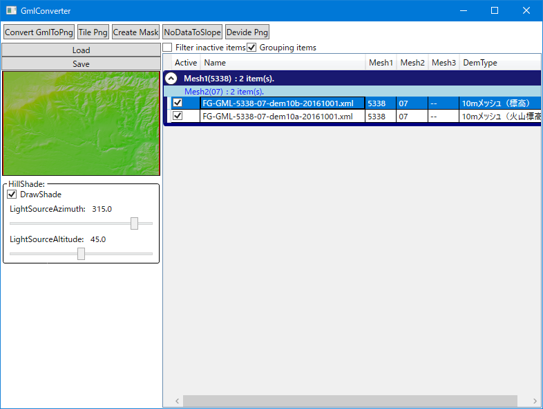

# ConvertGmlToPng

* GML 形式のファイルを読み込み、 Mesh2 毎にまとめた 16bit Grayscale Png を出力するモードです。
* 下の画像はこのモードに切り替えた直後の画面です。
	* 

> [!NOTE]
> * GML 形式についての知識が必要になります。
> * 詳しくは [基盤地図情報（数値標高モデル）](AboutGml.md) を参照してください。

## UI の機能

| 名称									| 概要																							|
|----									|----																							|
| Load									| 選択した任意の数の GML 形式のファイルを読み込みます。											|
| Save									| 1 ～ 複数の 16bit Grayscale Png ファイルを選択したフォルダに書き込みます。					|
| DrawShade								| 陰影起伏の描画をするかです。プレビュー用の設定で、出力に影響しません。						|
| LightSourceAzimuth					| 陰影起伏の光源の方角（ 0 が北で時計回り）です。プレビュー用の設定で、出力に影響しません。		|
| LightSourceAltiude					| 陰影起伏の光源の高度（ 0 が水平で 90 が天頂）です。プレビュー用の設定で、出力に影響しません。	|
| Filter inactive items					| リストの Active のチェックを外した項目を非表示にします。										|
| Grouping imtes						| リストをメッシュ毎にグループ化します。														|
| リストの Active チェックボックス		| 出力対象とするかの設定です。チェックを外すと Save の際に出力されません。						|

* ドラッグアンドドロップからのロード
	* GML 形式のファイルはドラッグアンドドロップでも読み込ませることができます。
* リストからの削除
	* リスト項目を右クリックからの Remove で削除できます。
	* Delete キーでも削除できます。
	* どちらも複数選択可能です。

> [!NOTE]
> * 陰影起伏について
> 	* 標高情報と光源の設定をもとに、陰影をつけるためのロジックです。
> 	* 以下のサイトに解説があります。
> 		* [Esri's ArcGIS > 陰影起伏の仕組み](https://pro.arcgis.com/ja/pro-app/latest/tool-reference/3d-analyst/how-hillshade-works.htm)

## 操作手順

1. __Load ボタン__ 、もしくはドラッグアンドドロップで GML 形式のファイルを開きます。
	* 下の画像は幾つかのファイルをロードし、リストから項目を選択した状態です。画面左側にリストで選択した項目のプレビューが表示されます。
		* 
	* __Grouping items__ にチェックを入れておくと、 以下のようなグループ化がなされます。
		* Mesh1 毎に一段目（MidnightBlue）のグループ化
			* この列には Mesh1 の番号(4 桁)、グループ内の項目数が表示されます。
		* Mesh2 毎に二段目（LightBlue）のグループ化
			* この列には Mesh2 の番号(2 桁)、グループ内の項目数が表示されます。
2. __Save ボタン__ で Mesh2 毎に合成して保存します。
	* 以下の命名規則で 16bit Grayscale Png ファイルが出力されます。
		* __([0-9]{4})-([0-9]{2})-([0-9]{2})([0-9]{2})-(1|5|10).png__
			* $1 __([0-9]{4})__: Mesh1の番号
			* $2 __([0-9]{2})__: Mesh2の番号
			* $3 __([0-9]{2})__: 最小のMesh3の番号
			* $4 __([0-9]{2})__: 最大のMesh3の番号
			* $5 __(1|5|10)__: ピクセル間距離
	* 上の画像の写っている範囲だと以下のファイルが出力されることになります。
		*  __6840-17__ は複数の __5m メッシュ__ が合成されて出力される。
		*  __6840-27__ は一つの __10m メッシュ__ と一つの __5m メッシュ__ の合計 2 ファイルが合成されて出力される。
		*  __6841-00__ は一つの __10m メッシュ__ と複数の __5m メッシュ__ の合計 52 ファイルが合成されて出力される。
	* 下の画像は実際の出力結果です。
		* 
	* 表にまとめると以下のようになります。
		| 名称					| Mesh1	| Mesh2	| Mesh3 最小	| Mesh3 最大	| ピクセル間距離	| サイズ		|
		|----					|----	|----	|----			|----			|----				|----			|
		| 6740-77-0099-10.png	| 6740	| 77	| 00			| 99			| 10				| 1225 x 750	|
		| 6741-70-0099-5.png	| 6741	| 70	| 00			| 99			| 5					| 2250 x 1500	|
		| 6840-07-0099-5.png	| 6840	| 07	| 00			| 99			| 5					| 2250 x 1500	|
		| 6840-17-0099-5.png	| 6840	| 17	| 00			| 99			| 5					| 2250 x 1500	|
		| 6840-27-0099-5.png	| 6840	| 27	| 00			| 99			| 5					| 2250 x 1500	|
		| 6841-00-0099-5.png	| 6841	| 00	| 00			| 99			| 5					| 2250 x 1500	|
		| 6841-10-0099-5.png	| 6841	| 10	| 00			| 99			| 5					| 2250 x 1500	|
		* __6740-77-0099-10.png__ は __5m メッシュ__ が存在しなかったため、ピクセル間距離が 10 となっています。
		* (サイズ、ピクセル間距離)が (1125 x 750 、 10m) で ( 1125 * 10m x 750 * 10m = 11.25km x 7.5km) 相当のデータとなります。
		* (サイズ、ピクセル間距離)が (2250 x 1500 、 5m) で ( 2250 * 5m x 1500 * 5m = 11.25km x 7.5km) 相当のデータとなります。
		* ここにはないですが、ピクセル間距離が 1m の __1m メッシュ__ のサイズは 11250 x 7500 となります。
	* なお、 Mesh2 を満たさないデータを保存した場合、サイズはこれより小さくなります。
	* 下の画像は 一つの Mesh1 / Mesh2 に 3つの __5m メッシュ__ をロードした状態です。
		* 
	* 下の画像は実際の出力結果です。
		* 
	* ファイルは以下の命名規則で出力されます。
		| 名称					| Mesh1	| Mesh2	| Mesh3 最小	| Mesh3 最大	| ピクセル間距離	| サイズ		|
		|----					|----	|----	|----			|----			|----				|----			|
		| 6741-70-2142-5.png	| 6741	| 70	| 21			| 42			| 5					| 450 x 450		|
		* (ピクセル間距離、サイズ)が (5m 、 450 x 450) で ( 450 * 5m x 450 * 5m = 2.25 km x 2.25 km) 相当のデータとなります。
	* 下の画像は [CreateMask](CreateMask.md) モードを利用して画像を表示している様子です。
		* 
		* 右上(6741-70-42)と中央部(6741-70-31 / 6741-70-32) のファイルを指定していないため、空白になっている様子が確認できます。
	* ファイルの内容
		* フォーマットは 16bit Grayscale Png です。
			> [!NOTE]
			> * Unreal Engine の Landscape として使用する場合、以下のように設定するとマッチします。
			> 	| ピクセル間距離	| Scale.x	| Scale.y	| Scale.z	| Location.z	|
			>	|----:				|----:		|----:		|----:		|----:			|
			>	| 1m				| 100.0		| 100.0		| 1280		| 277680		|
			>	| 5m				| 500.0		| 500.0		| 1280		| 277680		|
			>	| 10m				| 1000.0	| 1000.0	| 1280		| 277680		|
		* 各ピクセルが標高を表し、標高を +500m し、標高差 0.1m を 1 とした輝度値が設定されます。
		* 以下に例を示します。
			| 標高			| 輝度値		|
			|----:			|----:			|
			|    0.0m		|  5000			|
			| -200.0m		|  3000			|
			| 3700.0m		| 42000			|
			| データ無し	|     0			|
		* +500m しているのは、ゼロメートル地帯対策です。
		* GML 形式の高さの精度が 0.1m までが有効値となっているため、出力する Png の輝度値は標高を 10 倍した値を利用しています。

このあとは [TilePng](TilePng.md) を使い、一つの Png にまとめることを想定しています。

> [!NOTE]
> * 巨大な領域の扱い
> 	* フェイルセーフな対応をしていないので、日本全体など、大きな領域を読み込ませると大量のメモリを使うことになります。
> 	* 大きくとも Mesh2 で 5 x 5 程度に収めたほうが無難です。
> * 河川や湖沼などの水域
> 	* 標高が設定されていない（ __データなし__ に設定されている）ため、輝度値 0 として扱っています。
> 	* 以下は静岡県内ですが、川や池が赤色(= 輝度値 0 で抜け色扱い)（ __データなし__ ）になっていることが確認できます。
> 		* 
> * __火山標高(Dem10A)__ の __データなし__ の領域
>	 * 高山周辺では __火山標高(Dem10A)__ が提供されていますが、提供エリア内のすべてのデータが設定されているわけではありません。
> 	* 以下は富士山周辺の __火山標高(Dem10A)__ の様子です。
> 		* 
> 	* 以下は同じエリアの __標高(Dem10B)__ の様子です。
> 		* 
> 	* 基本的にこれらは重ねて使う必要があります。

以上。

----
