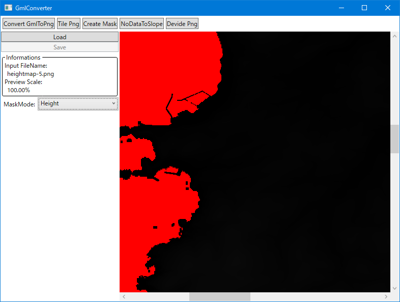
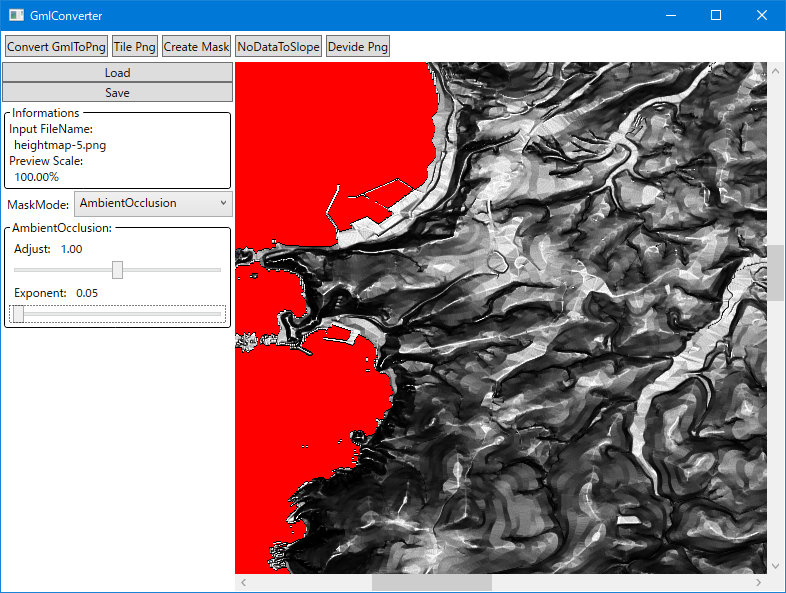

# CreateMask

* [TilePng](TilePng.md) で出力された Png ファイルからマスク画像を出力するモードです。
* 下の画像はこのモードに切り替えた直後の画面です。
	* 

## UI の機能

| 名称									| 概要																										|
|----									|----																										|
| Load									| 選択した Png ファイルを読み込みます。																		|
| Save									| 選択した Png ファイルに書き込みます。																		|
| Informations							| 現在読み込んでいるファイルの情報を表示します。															|
| Input FileName						| 現在読み込んでいるファイル名です。																		|
| Preview Scale							| プレビューの拡大率です。																					|
| MaskMode								| 出力するマスクの種類を指定します。																		|

* プレビューの操作
	* 右ドラッグ
		* 表示位置を移動します。
	* Ctrl + ホイール
		* 画像を拡大・縮小します。
	* Ctrl + 0
		* 拡大率を 100% に戻します。
* MaskMode
	* 指定できるのは以下のとおりです。
		| 名前				| 機能										| マスク出力の可否	|
		|----				|----										|----				|
		| Height			| グレイスケール画像をそのまま表示します。	| 不可				|
		| HillShade			| 陰影起伏を表示します。					| 不可				|
		| AmbientOcclusion	| AmbientOcclusion 用のマスクです。			| 可				|
		| Curvature			| 曲率を用いたマスクです。					| 可				|
	* Height
		* 下の画像はこのモードの様子です。
			* 
		* データ確認用です。
	* HillShade
		* 下の画像はこのモードの様子です。
			* 
		* UI の機能
			| 名称									| 概要																					|
			|----									|----																					|
			| DrawShade								| 陰影起伏の描画をするかです。															|
			| LightSourceAzimuth					| 陰影起伏の光源の方角（ 0 が北で時計回り）です。										|
			| LightSourceAltiude					| 陰影起伏の光源の高度（ 0 が水平で 90 が天頂）です。									|
		* データ確認用です。
		* [ConvertGmlToPng](ConvertGmlToPng.md) で表示しているものと同じです。
	* AmbientOcclusion
		* 下の画像はこのモードの様子です。
			* 
		* UI の機能
			| 名称									| 概要																					|
			|----									|----																					|
			| Adjust								| 出力値調整用の係数です。																|
			| Exponent								| 出力値調整用の指数です。																|
		* ここで行われている計算は周囲の 8 点が自身の標高より高いほど・高い点が多いほど輝度値が低くなるように実装しています。
		* 動作確認用に作った簡易的なもので、正確には AmbientOcclusion ではありません。
	* Curvature
		* 下の画像はこのモードの様子です。
			* 
		* UI の機能
			| 名称									| 概要																					|
			|----									|----																					|
			| Adjust								| 出力値調整用の係数です。																|
			| Exponent								| 出力値調整用の指数です。																|
			| AngleBase								| 曲率計算用の角度に加算する調整用の値です。											|
			| MaskHeightMin							| 出力する最低標高で、これより低い標高の出力を抑制します。								|
			| MaskHeightMax							| 出力する最高標高で、これより高い標高の出力を抑制します。								|
			| NegaPosi								| 出力する曲率の正負です。																|
			| Positive								| 正の曲率の情報を出力します。（凸が輝度値 0.0 、凹が輝度値 1.0 ）						|
			| Negative								| 負の曲率の情報を出力します。（凸が輝度値 1.0 、凹が輝度値 0.0 ）						|
			| AngleDirectionMode					| 斜面の方向の情報を出力するようにします。												|
			| AngleDirection						| 下ると輝度値を高くする方角（ 0 が北で時計回り）です。									|
		* 下の画像は設定を __Negative__ にした時の様子です。 __Positive__ の時に輝度値が高くなっていた凹地が輝度値が低くなり、海岸や山頂などの輝度値が高くなります。
			* 
		* 下の画像は設定を __AngleDirectionMode__ にした時の様子です。北側に下る斜面ほど輝度値が高く、逆側が輝度値が低くなります。
			* 

> [!NOTE]
> * プレビューの描画について
> 	* WPF では深度が 16bit の BitmapSource データを表示に使っても、下位 8bit が捨てられてしまいます。
> 	* そのため、ロード時に rgb カラーの bitmap を生成し、 b/g チャンネルに 下位/上位 のデータを設定し、 Image コントロールの Source にしています。
> 	* 更に Image コントロールの Effect に自前のシェーダー設定した ShaderEffect 派生クラスを指定することで表示を切り替えています。
> 	* その弊害で、 b チャンネルの値が 0xff と 0x00 が並ぶ事が多く、拡大縮小時にその周辺をサンプリングした際に中間色を取得してしまい、表示に問題が出ることがあります。

## 操作手順

1. __Load ボタン__ で Png ファイルを指定します。
	* 読み込むファイルは [TilePng](TilePng.md) で出力される命名規則に従ったファイルのみで以下のような命名規則です。
		* __(.*)-(1|5|10).png__
			* $1 __(.*)__: 任意の文字列
			* $2 __(1|5|10)__: ピクセル間距離
	* ルールに沿っていないファイルを指定しても読み込みません。
	* 逆に、それさえ守っている 16bit Grayscale Png であれば、別のツールで作った Png でも読み込み可能です。
2. AmbientOcclusion / Curvature の設定を調整します。
3. __Save ボタン__ で現在設定中の MaskMode の Png ファイルが保存されます。
	* 一度に 1 ファイルだけ出力されます。複数必要な場合はそれぞれ保存する必要があります。
	* ファイルの内容
		* フォーマットは 16bit Grayscale Png です。

このあとは [NoDataToSlope](NoDataToSlope.md) を使い、輝度値が0の領域を傾斜にすることを想定しています。

> [!NOTE]
> * もっと高品質なマスクの作成には [Houdini](https://www.sidefx.com/ja/community-main-menu/complete-a-z-terrain-handbook/) などが利用できます。

以上。

----
