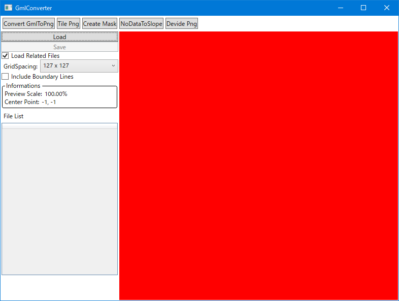
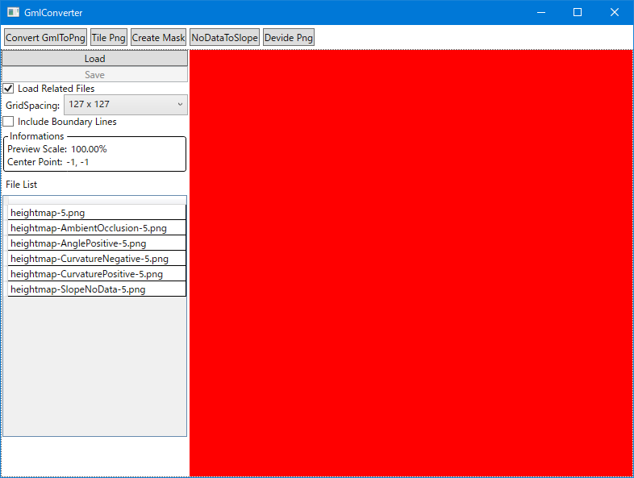
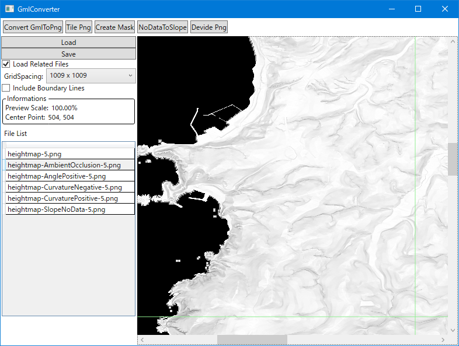
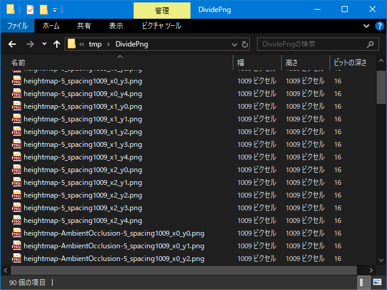

# DevidePng

* [CreateMask](CreateMask.md) で出力された Png ファイルを一定サイズの格子状に分割した Png ファイルを出力するモードです。
* 下の画像はこのモードに切り替えた直後の画面です。
	* 

## UI の機能

| 名称									| 概要																										|
|----									|----																										|
| Load									| 選択した Png ファイルを読み込みます。																		|
| Save									| 選択したフォルダに読み込んでいるファイルを分割したファイルを書き込みます。								|
| Load Related Files					| 類似したファイルを同時に読み込むかの設定です。															|
| GridSpacing							| 分割する格子の間隔です。																					|
| Include Boundary Lines				| 出力時、境界線を両方の Png ファイルに重複させるかの設定です。												|
| Informations							| 現在読み込んでいるファイルの情報を表示します。															|
| Preview Scale							| プレビューの拡大率です。																					|
| Center Point							| 分割の中心点です。																						|
| File List								| 読み込んでいるファイルのリストです。選択すると右側のプレビューに表示されます。							|

* プレビューの操作
	* 右ドラッグ
		* 表示位置を移動します。
	* Ctrl + ホイール
		* 画像を拡大・縮小します。
	* Ctrl + 0
		* 拡大率を 100% に戻します。
	* 左クリック
		* クリックした場所が分割後の画像の中心になるように設定します。
* Load Related Files
	* __basename(-(?:0|5|10))?\.png__ を元の名前とすると、 __basename.*(-(?:0|5|10))?\.png__ を満たすファイルを読み込みます。
	* ただし、画像の幅と高さが最初に指定したファイルと異なる場合は一覧から外されます。
	* 下の画像は __Load Related Files__ にチェックを入れた状態で __heightmap-5.png__ を開いた時の様子です。
		* 
		* ファイルの内容は以下の通り。
			| ファイル名							| 内容				| 作成方法								|
			|---- 									|----				|----									|
			| heightmap-5.png						| 高さマップ画像	| [TilePng](TilePng.md)					|
			| heightmap-SlopeNoData-5.png			| マスク画像		| [CreateMask](CreateMask.md)			|
			| heightmap-AmbientOcclusion-5.png		| マスク画像		| [CreateMask](CreateMask.md)			|
			| heightmap-AnglePositive-5.png			| マスク画像		| [CreateMask](CreateMask.md)			|
			| heightmap-CurvatureNegative-5.png		| マスク画像		| [CreateMask](CreateMask.md)			|
			| heightmap-CurvaturePositive-5.png		| 高さマップ画像	| [NoDataToSlope](NoDataToSlope.md)		|
	* すでにファイルを開いている状態でも幅と高さが同じであれば追加でファイルを開くことも可能です。
* GridSpacing
	* 選択できる値は以下のとおりです。
		* 127 x 127
		* 253 x 253
		* 505 x 505
		* 1009 x 1009
		* 2017 x 2017
		* 4033 x 4033
		* 8129 x 8129
	* これらは Unreal Engine の Landscape のインポートで利用するのにちょうどいいサイズになっています。
* Include Boundary Lines
	* この設定を変更したときの挙動は以下のようになります。
		* 例1: 元画像のサイズが 254 x 127 、 __GridSpacing__ が 127 x 127 、 __Include Boundary Lines__ が Off 、 __Center Point__ が 64,64 の場合
			* 127 x 127 の画像が 2 つ出力されます。
			* 重複する画素はありません。
		* 例2: 例1 の設定のうち、 __Include Boundary Lines__ を On にした場合
			* 127 x 127 の画像が 3 つ出力されます。
			* 元画像の範囲外の部分は輝度値が 0 で埋められます。
			* 分割後の 3 つの画像の左端と右端の画素は、元の画像のどこの座標になるかをまとめると以下のようになります。
				| ファイル	| 左端	| 右端			|
				|----		|----	|----			|
				| 一枚目	| 0		| 126			|
				| 二枚目	| 126	| 252			|
				| 三枚目	| 252	| 画像の範囲外	|
	* この機能の用途は、出力ファイルを個々の画像毎に Unreal Engine の Landscape にインポートしたい場合に有用です。
		* このチェックを入れておけば、別々の Landscape を並べて置いても隙間ができなくなります。

## 操作手順

1. __Load ボタン__ で Png ファイルを指定します。
	* 読み込むファイルは 16bit Grayscale Png であれば読み込み可能です。
	* __Load Related Files__ を利用すれば、同じようなファイル名で同じサイズのファイル群を一度に読み込めます。
2. __GridSpacing__ / __Include Boundary Lines__ / __Center Point__ の設定をします。
	* 下の画像は __GridSpacing__ を 1009 x 1009 にし、 __Center Point__ を指定したあとの様子です。
		* 
3. __Save ボタン__ で保存するフォルダを指定します。
	* 設定に従い分割した Png ファイルが出力できます。
	* 複数のファイルを開いている場合、すべてのファイルに対して処理が行われます。。
	* 下の画像は出力フォルダの様子です。
		* 
		* 横に 3 縦に 5 分割され、 2 つの高さマップ画像と 4 つのマスク画像を分割したので 3 * 5 * (2 + 4) = 90 ファイル出力されています。
	* 以下の命名規則で出力されます。
		* **{もとのファイル名}_spacing{格子の間隔}_x{横の分割番号}_y{縦の分割番号}.png**
		* ファイル名の末尾を **x0_y0** としていますが、こうすることで Landscape のインポート時に分割されたファイルとして一気に読み込むことができます。
			* Landscape のインポート用の素材として利用する場合、 __Include Boundary Lines__ をオフにし、重複箇所がないようにします。
	* ファイルの内容
		* 入力ファイルと同じフォーマットです。

このあとは Unreal Engine の Landscape にインポートすることを想定しています。

以上。

----

