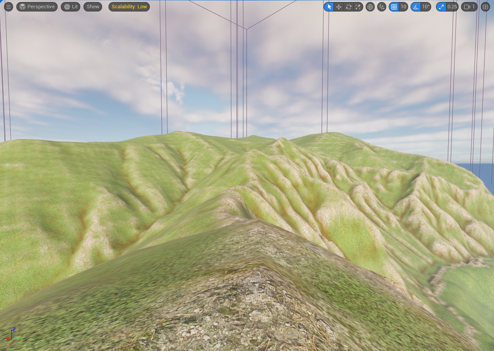
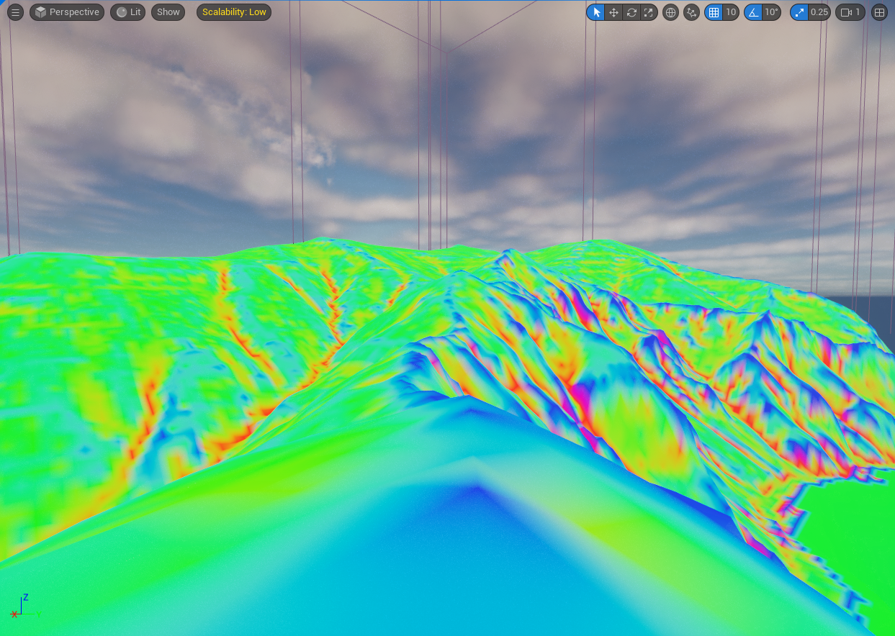
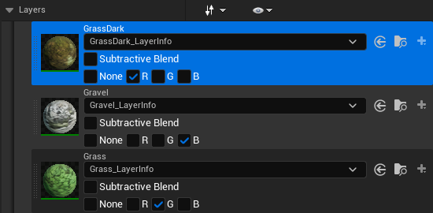
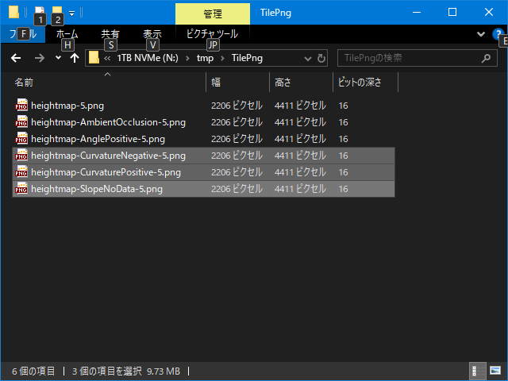
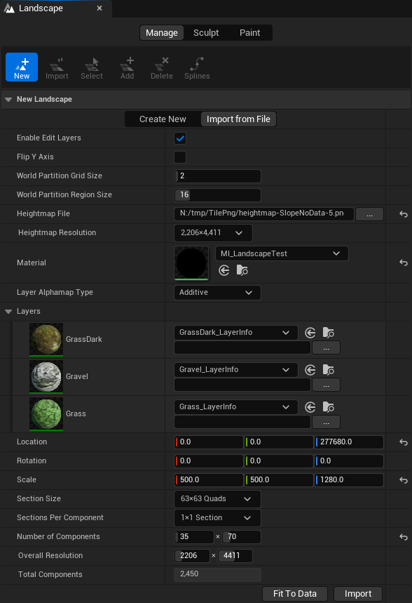
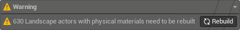
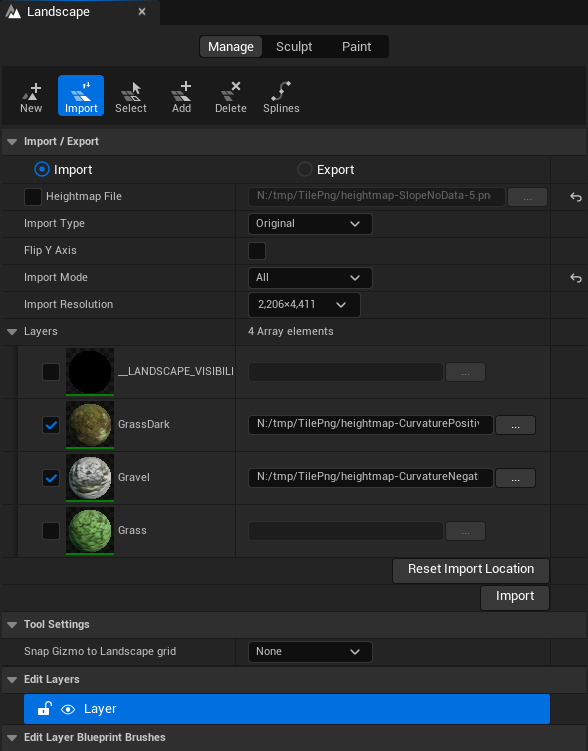

# Landscape

* Unreal Engine のランドスケープでの使用サンプルです。
* ここでは、明るい草を基本とし、砂利を稜線に、暗い草を谷に配置するように設定してみます。
* 以下の画像は各種設定を行ったあとの様子です。
	* 
* 以下の画像は View Mode で Landscape Visualizer の Layer Debug を指定した様子です。
	* 
* 以下の画像は各レイヤーの色の設定の様子です。
	* 

## 操作手順

1. インポート用の画像を用意します。
	* 以下の画像はインポートで使用するファイルです。
		* 
	* 各ファイルの用途は以下のとおりです。
		| 名前									| 用途					|
		|----									|----					|
		| heightmap-SlopeNoData-5.png			| Heightmap File		|
		| heightmap-CurvatureNegative-5.png		| Layers > Gravel		|
		| heightmap-CurvaturePositive-5.png		| Layers > GrassDark	|
	* Grass レイヤーは他のレイヤーで塗られていない場所にするので、インポート用の画像は使用しません。
	* 解像度はすべて __2206 x 4411__ となっています。
		* これは [TilePng](TilePng.md) で __SectionSize__ を __63 x 63__ にしている結果です。
			* __2206 x 4411__ == __63 * 35 + 1 x 63 * 70 + 1__
		* __Landscape__ の __Section Size__ を __63x63 Quads__ にするとサイズに端数がなくなるようになっています。
2. Landscape 用の Material を用意します。
	* レイヤーの用途は以下のとおりです。
		| 名前				| 用途						|
		|----				|----						|
		| GrassDark			| 凹地用の暗い草			|
		| Gravel			| 平地用の砂利				|
		| Grass				| それ以外の部分の明るい草	|
	* マテリアルの作成方法は公式ドキュメントを参照してください。
3. Landscape 配置用のレベルを用意します。
	* __File > New Level__ を選択します。
	* __New Level__ ダイアログで __Open World__ を選択し __Create__ します。
		> [!NOTE]
		> これは一例です。
		> ライトやスカイボックスの設定を省略するためにこれを選んでいます。
	* __Outliner__ で __Landscape__ 以下のオブジェクトを削除し、 __Landscape__ 自体も削除します。
4. Landscape を作成します。
	* __レベルエディタモード__ を __Landscape__ に変更します。
	* __Landscape ツール__ で __Managed モードタブ__ 、__New タブ__ 、 __Import from File タブ__ を選択します。
	* 以下の画像は設定の様子です。
		* 
	* 設定の内容は以下のとおりです。
		| 項目					| 設定								|
		|----					|----								|
		| Heightmap File		| heightmap-SlopeNoData-5.png		|
		| Material				| 2. で作成したマテリアル			|
		| Location				| 0.0, 0.0, 277680.0				|
		| Scale					| 500.0, 500.0, 1280.0				|
		| Number of Components	| Heightmap File 指定時に計算される	|
		* 補足
			* Scale の X,Y 値は 5 メートルメッシュのデータのため、500 にしています。
			* Scale の Z 値 と Location の Z 値は標高と合わせるための値です。
			* Layers の Landscape Layer(GrassDark_LayerInfo 等) もここで作っておきます。
			* Layers の Landscape Layer のインポートは Grass を Fill Layer したあとで行うため、ここでは指定しません。
	* __Import ボタン__ を押し、インポートを実行します。
	* 一旦保存してレベルを開き直します。
	* __World Paation ツール__ で作成した __LandscapeRegion_x_y__ を矩形選択し、 __Load Selected Region(s)__ を選び、全リージョンをロードします。
		> [!NOTE]
		> これは一例です。
		> Landscape が一度に読み込めないほど大きい場合は適宜読み替えてください。
	* Landscape actor の physical material のリビルドが必要という警告が出るのでリビルドしておきます。
		* 以下の画像はその様子です。
			* 
		* 以降、リビルドが必要になるとこの警告は表示されるので、状況に応じてリビルドを実行します。
5. Grass で Fill Layer します。
	* __Landscape ツール__ で __Paint モードタブ__ を選択します。
	* __Layers > Grass__ を選択し、 __右クリック > Fill Layer__ を選択し、全領域が Grass レイヤーが描画されるように塗り潰します。
6. GrassDark と Gravel の Landscape Layer をインポートします。
	* __Landscape ツール__ で __Managed モードタブ__ 、__Import タブ__ を選択します。
	* 以下の画像は設定の様子です。
		* 
	* 設定の内容は以下のとおりです。
		| 項目					| 設定								|
		|----					|----								|
		| Import Mode			| All								|
		| Layers > GrassDark	| heightmap-CurvaturePositive-5.png	|
		| Layers > Gravel		| heightmap-CurvatureNegative-5.png	|
	* __Import ボタン__ を押し、インポートを実行します。
	* 一旦保存してレベルを開き直します。
7. World Partition Editor Minimap をビルドします。
	* __World Paation ツール__ で作成した __LandscapeRegion_x_y__ を矩形選択し、 __Load Selected Region(s)__ を選び、全リージョンをロードします。
	* __World Paation ツール__ の左上にある __Build ボタン__ から __Build World Partition Editor Minimap__ を選びます。
	* 出力が終わると __World Paation ツール__ 内のミニマップの内容が更新されます。

以上。

----
