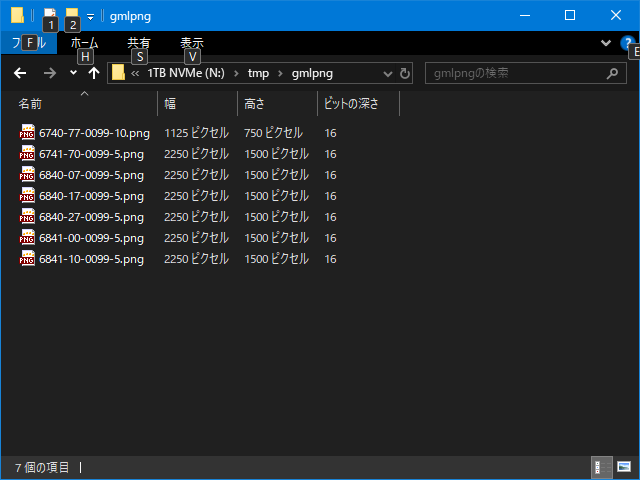

# TilePng

* [ConvertGmlToPng](ConvertGmlToPng.md) で出力された Png ファイルを一つの Png にまとめて出力するモードです。
* 下の画像はこのモードに切り替えた直後の画面です。
	* 

## UI の機能

| 名称									| 概要																										|
|----									|----																										|
| Load									| 選択したフォルダ内にある命名規則に沿った Png ファイルを読み込みます。										|
| Save									| 選択した Png ファイルに書き込みます。																		|
| Informations							| 現在読み込んでいるファイルの情報を表示します。															|
| Input Size							| 読み込んだ Png ファイルを結合してできたリサイズ前の Png のサイズです。									|
| Input PixelDistance					| 読み込んだ Png ファイルで最も小さいピクセル間距離です。(1 or 5 or 10)										|
| Output Size							| 出力する Png のサイズです。（トリミングは考慮されません）													|
| Output PixelDistance					| 出力するピクセル間距離です。 PixelDistance の設定に従います。												|
| PixelDistance							| 出力するピクセル間距離の設定です。 __Minimum__ を選択すると __Input PixelDistance__ の値が利用されます。	|
| Trimming								| 出力する際に外周部のデータがない領域（ 輝度値が 0 の部分）をトリミングする場合はチェックを入れます。		|
| Margin								| 出力する際に外周部のデータがない領域（ 輝度値が 0 の部分）を追加する場合はチェックを入れます。			|
| Size									| マージンのサイズでこの値だけ上下左右にマージンが設けられます。											|
| SectionSize							| マージンの値を調整し、出力時の画像サイズを __SectionSize * n + 1__ となるようにします。					|

## 操作手順

1. __Load ボタン__ で Png ファイルが置かれたフォルダを指定します。
	* 読み込むファイルの命名規則は [ConvertGmlToPng](ConvertGmlToPng.md) を参照してください。
	* 下の画像は [ConvertGmlToPng](ConvertGmlToPng.md) で出力したフォルダの内容です。
		* 
	* 下の画像は上記のフォルダを指定した状態です。画面右側にプレビューが表示されます。
		* 
	* 読み込むファイルは [ConvertGmlToPng](ConvertGmlToPng.md) で出力される命名規則に従ったファイルのみで、他は無視されます。
2. __PixelDistance コンボボックス__ で出力時のピクセル間距離を指定します。
	*  __Minimum__ の場合
		*  読み込んだファイルのうちの一番小さいピクセル間距離を利用します。
		* 前述の例では 5,10 のピクセル間距離のデータが含まれており、 5 が使用されることになります。
		* ピクセル間距離が 10 のエリアは拡大したデータが利用されます。
	* それ以外の場合
		* 指定された値に拡大縮小してデータを作成します。
		* 前述の例で 10 を指定すると、 5 と 10 のエリアがあるため、 5 のエリアは縮小したデータが利用されます。
3. __Trimming__ や __Margin__ を指定します。
	* 下の画像は __Trimming__ と __Margin__ を有効にし、 __Size__ を 100 、 __SectionSize__ を 63x63 にした状態です。
		* 
		* __Informations__ の __Output Size__ は反映されません。（出力時まで処理を行っていない為）
4. __Save ボタン__ で読み込まれた Png ファイルが結合され、一つの大きな Png ファイルが保存されます。
	* 下の画像は出力フォルダです。
		* 
		* 設定を変えて出力した3つのファイルがあります。
			| ファイル名		| 幅	| 高さ	| Triming	| Margin	| SectionSize	|
			|----				|----	|----	|----		|----		|----			|
			| not_trim-5.png	| 4500	| 6000	| 無し		| 0			| 0				|
			| trim-5.png		| 1977	| 4199	| 有り		| 0			| 0				|
			| heightmap-5.png	| 2206	| 4411	| 有り		| 100		| 63x63			|
			* trim-5.png と heightmap-5.png の幅を比較すると以下のようになります。
				* trim-5.png の幅に左右に 100 のマージンを追加:
					* 1977 + 100 + 100 = 2177
				* __SectionSize * n + 1__ になっているか確認:
					* 2177 = 34 * 63 + 35
				* __SectionSize * n + 1__ になるようにマージン追加:
					* 2206 = 35 * 63 + 1
		* Triming は、特に理由がなければすることをおすすめします。
		* Margine Size は、離島など、海に接するエリアで利用することをおすすめします。
		* Section Size は、Unreal Editor の Landscape で利用する場合は指定することをおすすめします。
		* ファイル名は、デフォルトでは以下の命名規則で出力します。
			* __heightmap-(1|5|10).png__
				* $1 (1|5|10): ピクセル間距離
		* __-(1|5|10)__ は、次の [CreateMask](CreateMask.md) の際にピクセル間距離として利用します。
		* ファイル名を変更する場合は __heightmap__ の部分を変更することをおすすめします。
	* ファイルの内容
		* [ConvertGmlToPng](ConvertGmlToPng.md) の出力と同様です。

このあとは [CreateMask](CreateMask.md) を使い、マスク画像を作ることを想定しています。

以上。

----

