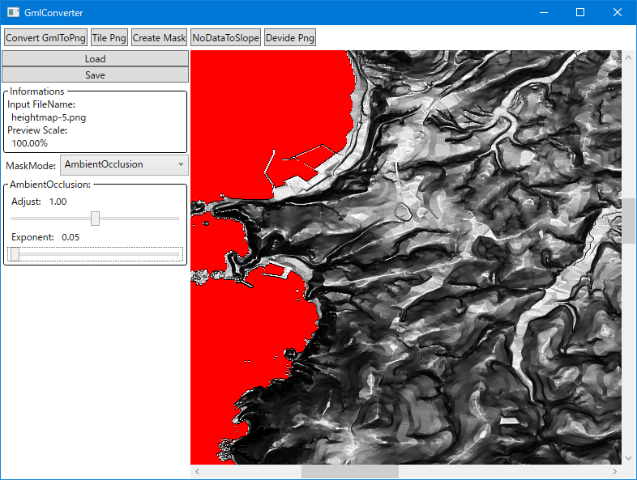
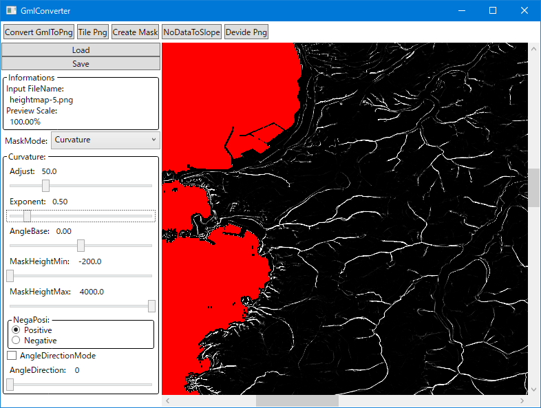

# GmlConverter

これは、国土地理院で公開されている [基盤地図情報（数値標高モデル）](documents/AboutGml.md) をもとに Png ファイルを出力するためのツールです。

* 下の画像はアプリケーションを実行した時の様子です。
	* 
	* 
	* 

## 使用方法

* モード
	* 5 つのモードがあります。
		| モード			| 用途																							|
		|----				|----																							|
		| [ConvertGmlToPng]	| GML 形式のファイルを 16bit Grayscale Png ファイルに変換する機能 								|
		| [TilePng] 		| 16bit Grayscale Png を結合し、一つの大きな 16bit Grayscale Png を出力する機能 				|
		| [CreateMask] 		| 16bit Grayscale Png をもとに曲率などを利用したマスク用 16bit Grayscale Png を出力する機能 	|
		| [NoDataToSlope] 	| 16bit Grayscale Png をもとに輝度値が 0 の部分を 0 以外の部分から傾斜にする機能			 	|
		| [DividePng] 		| 16bit Grayscale Png を一定の矩形サイズに分割する機能 											|
	* 起動直後は [ConvertGmlToPng] モードになっています。
	* モードの切替は画面上部の 5 つのボタンで行います。
	* モードを切り替えると、前のモードの内容はクリアされます。
	* 各モードについて、詳しくはそれぞれのドキュメントを参照してください。
* 用途
	* このツールの出力ファイルは Unreal Engine の Landscape でインポートに利用できます。
	* 下の画像はインポートした時の様子です。
		* 
	* 詳しくは [Landscape](documents/Landscape.md) を参照してください。

## 開発環境

| 分類				| ツール名										| 用途											|
|----				|----											|----											|
| 統合環境			| Visual Studio Community 2022(17.10.1)			| アプリケーション実装							|
| 使用言語			| C#											| アプリケーション実装							|
|					| HLSL											| マスク画像を動的にプレビューするために使用	|
| プラットフォーム	| WPF											| アプリケーション実装							|
| ライブラリ		| [Magick.NET-Q16-AnyCPU]						| 16bit Grayscale の合成のために使用			|
|					| [Magick.NET.SystemWindowsMedia]				| WPF との連携の簡素化のために使用				|
|					| [Microsoft.Extensions.DependencyInjection]	| DI に利用										|
|					| [OpenCVSharp4]								| 画像の解析のために使用						|
|					| [OpenCVSharp4.runtime.win]					| OpenCVSharp4 のランタイムライブラリ			|

以上。

----

[ConvertGmlToPng]: documents/ConvertGmlToPng.md
[TilePng]: documents/TilePng.md
[CreateMask]: documents/CreateMask.md
[NoDataToSlope]: documents/NoDataToSlope.md
[DividePng]: documents/DividePng.md

[Magick.NET-Q16-AnyCPU]: https://www.nuget.org/packages/Magick.NET-Q16-AnyCPU
[Magick.NET.SystemWindowsMedia]: https://www.nuget.org/packages/Magick.NET.SystemWindowsMedia
[Microsoft.Extensions.DependencyInjection]: https://www.nuget.org/packages/Microsoft.Extensions.DependencyInjection/
[OpenCVSharp4]: https://www.nuget.org/packages/OpenCvSharp4
[OpenCVSharp4.runtime.win]: https://www.nuget.org/packages/OpenCvSharp4.runtime.win